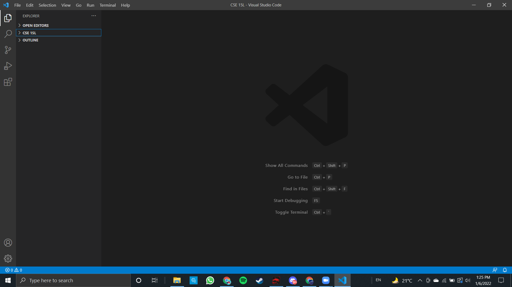
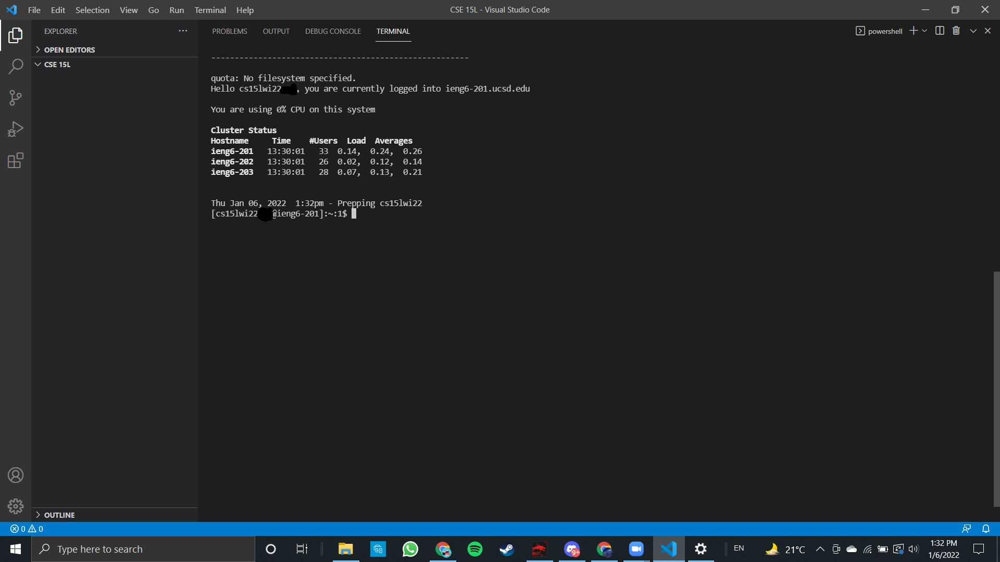
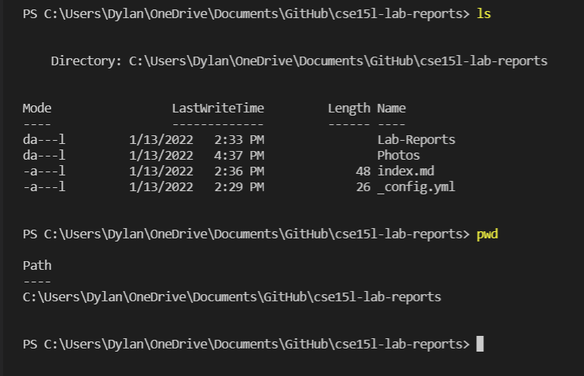
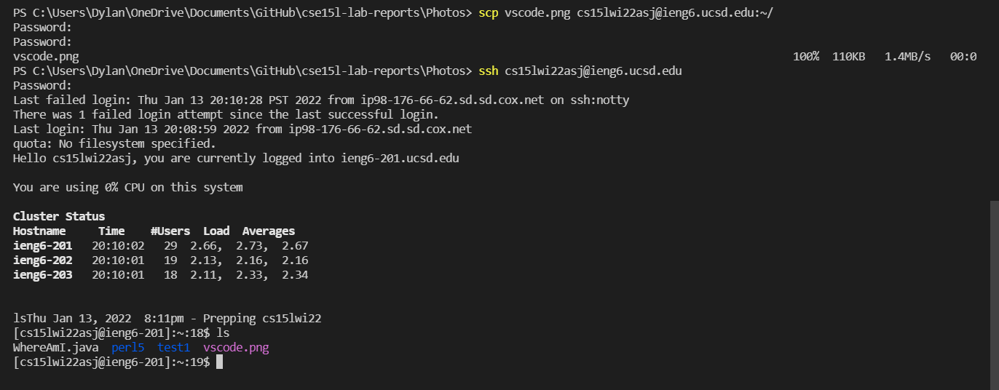
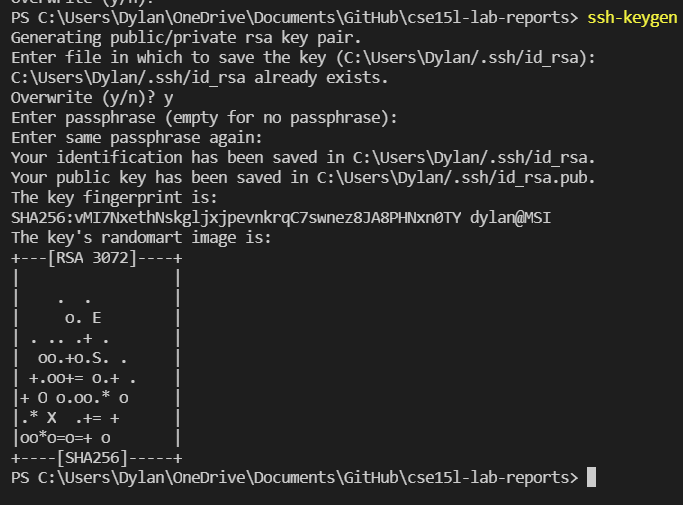
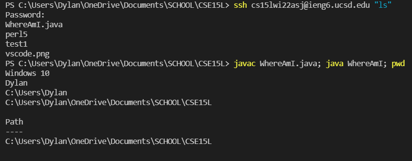

*Lab Report detailing how to remotely connect to a remote dektop to edit and copy files*  

**1. Install and get certain things** 
1. **VSCODE** 
 Download on [link](https://code.visualstudio.com/) 
 After installation, should get:
2. **JAVA** 
Download latest version of JDK on Oracle
3. **OpenSSH** 
In **Apps --> Optional Features**. Search for OpenSSH CLient and Open SSH Server
4. **Username** 
Open this [link](https://sdacs.ucsd.edu/~icc/index.php) to get the course specific username for cse15Lwi22azz@ieng6.ucsd.edu (zz will be different for each person)

**2. Connecting to Host** 

Input **ssh cs15lwi22azz@ieng6.ucsd.edu** into your terminal and input your password when asked.
You will see this once you are successfull:
 
To exit the remote desktop, input **exit** or **logout**

**3. Commands to know** 

1. **ls** - list down files and folders in directory
2. **pwd** - prints out path to current location
3. **cd** - change directory:  
   1. **..** - change to parent directory
   2. **~** - change to home
   3. **(folder name)** - change to folder specified
4. **mkdir** - make new directory with name after the command

**Photo of ouput of ls and pwd** 

**4. SCP** 
scp is a command to copy files from one location to another, in this case, from your desktop to a remote desktop.
The syntax top copy to the UCSD remote desktop is: 
**scp filename cs15lwi22azz@ieng6.ucsd.edu:~/** 
The system will then ask for password after which it will be copied.
Go into the remote desktop and input **ls** and it should show the copied file.

**5. SSH Key** 
Creates a key so password will not need to be inputted everytime we try to access the remote desktop.
Input **ssh-keygen** and a few prompts will appear,enter nothing for default setup for each prompt and then a key will be created.

**6. Extra Tips for Remote Access** 
1. Run commands on server then exit 
  -Use quotation marks with a command (" ") after **ssh cs15lwi22azz@ieng6.ucsd.edu** to run the command on the remote desktop 
2. Semicolons ( **;** ) can be used to combine multiple command in a single line 
3. Up arrow will go through previous commands that you have put in before

