*Lab report detailing difference between own and reviewed markdown parse files* 

Link to [Reviewed Repo](https://github.com/Shree-G/markdown-parse)
Link to [Own Repo](https://github.com/Dpingkar/CSE15L-RoseateSpoonbill)

**Snippet 1** 
Based on the preview 
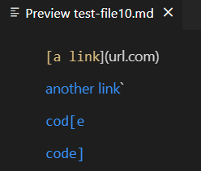 
We can assume that the links that are working are: `google.com` (with a backtick), `google.com` and `ucsd.com`

Thus, the test created is as follows:
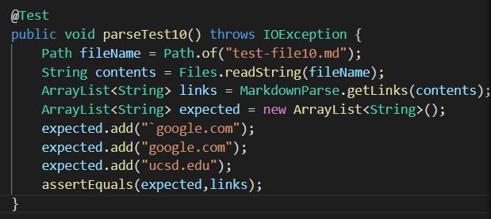

For my own code, the output didn't match the expected results, thus making it fail.
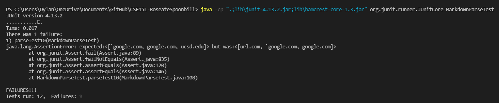

For the reviewed code, the output didn't match the expected results, thus making it fail.
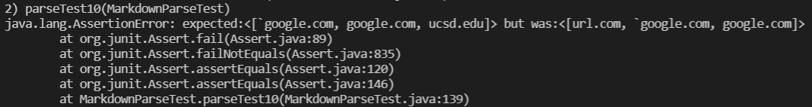

*Possible Changes* 
Within 10 lines, ignore backticks. Then before adding the string to the array, remove the backticks using any method possible.

**Snippet 2** 
Based on the preview 
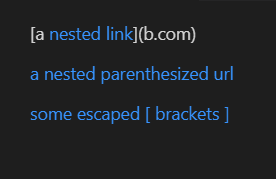 
We can assume that the links that are working are: `a.com`, `a.com(())` and `example.com`

Thus, the test created is as follows:
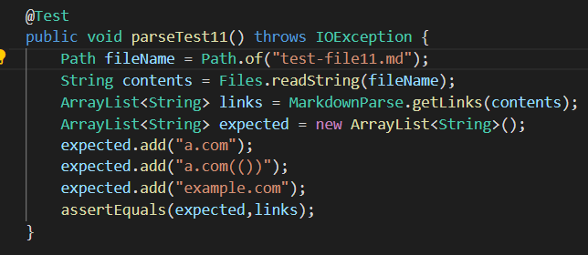

For my own code, the output didn't match the expected results, thus making it fail.
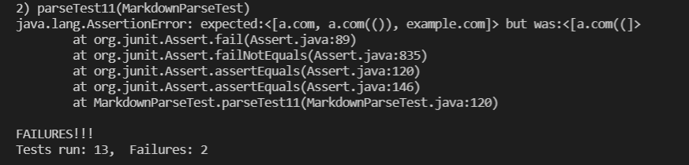

For the reviewed code, the output didn't match the expected results, thus making it fail.
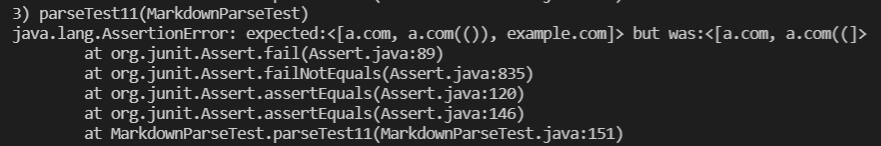

*Possible Changes* 
We can add a counter to count nested parenthesis and brackets. This will allow us to count the possible nested links and will be able to accurately retrieve the correct link by getting the most inner ones.  

**Snippet 3** 
Based on the preview 
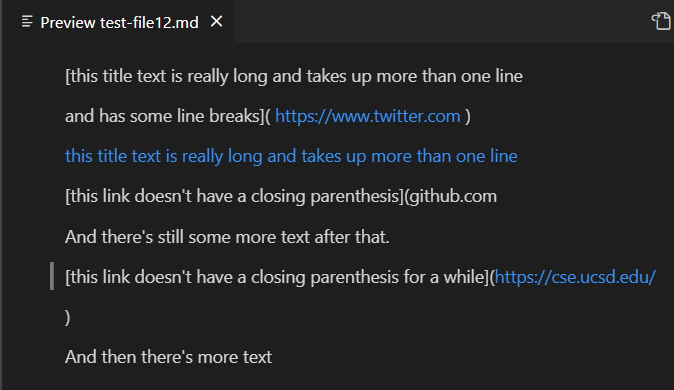 
We can assume that the links that are working are: `https;//www.twitter.com`, `https;//ucsd-cse15l-wi22.github.io/` and `https;//cse.ucsd.edu/`

Thus, the test created is as follows:
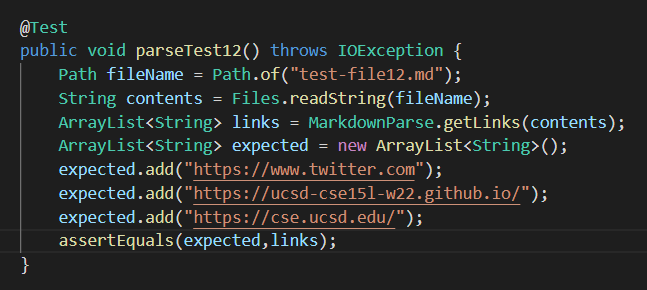

For my own code, the output didn't match the expected results, thus making it fail.
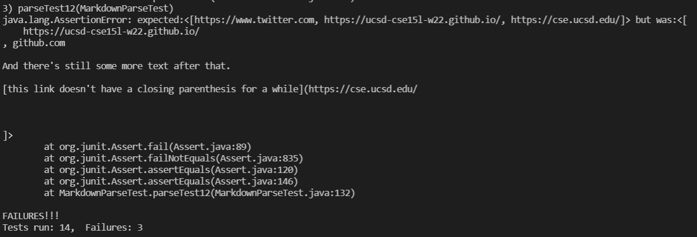

For the reviewed code, the output didn't match the expected results, thus making it fail.
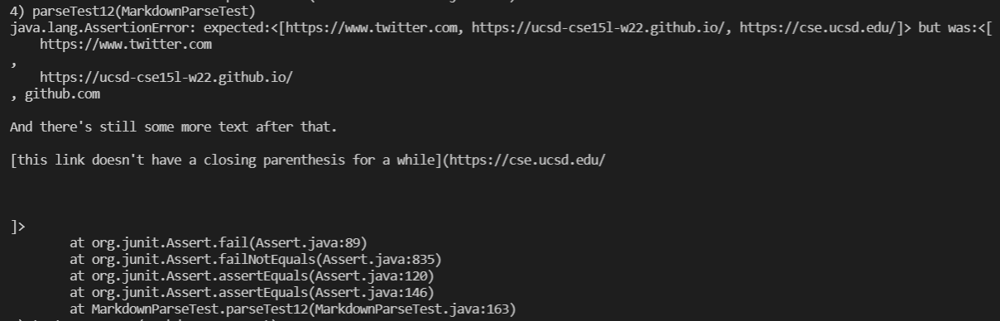

*Possible Changes* 
Before adding the string into the arrayList, we can clean up the string by removing unwanted spaces. We can also add a limit to the number of spaces within the link and if it goes over the limit we can prevent the string from being added to the array list.