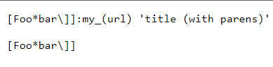
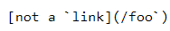
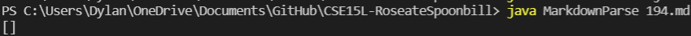
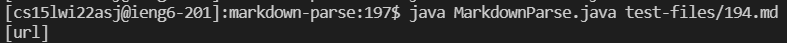
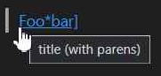

*Lab report entailing difference between own code and code given by professor* 

**How different testers are found**
1. Opened the **test-files** folder
2. Manually and randomly looked through the tests and checking what each test tested.
3. Found  two tests: 
      * 194.md  
      * 324.md 
       
4. Copied the two tests into own repository, and ran to get results

**Test 194.md** 
* *Own Code Test results* 
* *Class Code Test results* 
* *Expected output based on preview* 

* Neither outputs are correct based on the preview as the expected output should be `[title(with parens)]`

* *To Fix*

