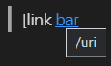
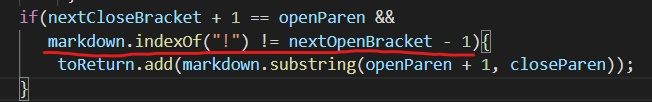

*Lab report entailing difference between own code and code given by professor* 

**How different testers are found**
1. Opened the **test-files** folder
2. Manually and randomly looked through the tests and checking what each test tested.
3. Found  two tests: 
      * 513.md  
      * 324.md 
       
4. Copied the two tests into own repository, and ran to get results

**Test 513.md** 
* *Own Code Test results* 
* *Class Code Test results* 
* *Expected output based on preview* 

* Own output is incorrect based on the preview as the expected output should be `[/uri]` Class code is correct

* *To Fix* 
Error: \
This causes an Error as in a situation where `!` doesn't exist and the first open bracket is at index 0,  the condition will be met and the link would not be added into the arrayu list. To fix this, we can add another condition to specify that if nextOpenBracket is equal to 0, we can ignore the `!` condtion, by putting the `!`in an else statement if nextOpenBracket is not 0.

**Test 324.md** 
* *Own Code Test results* 
* *Class Code Test results* 
* *Expected output based on preview* 

* Neither outputs are correct based on the preview as the expected output should be `[]`

* *To Fix* 
For my own code, the bug is from the fact that my own code does not have any conditions in regards to ticks. The expected output is located in around and between the two ticks of the code, which would mean that a condition has to be set that code between two ticks would be prioritised over other conditions.
Code is shown below: 
